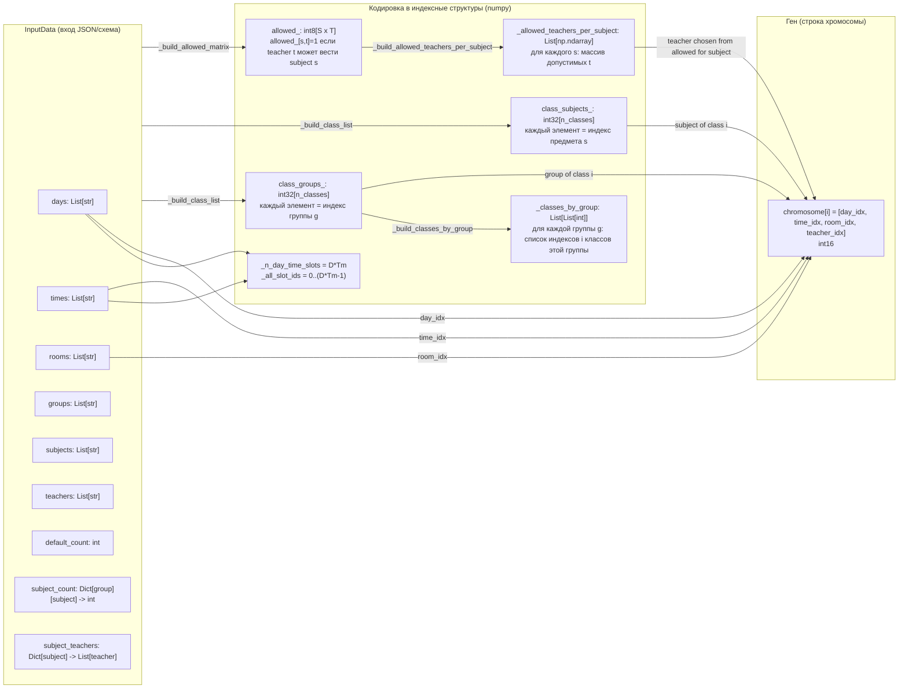
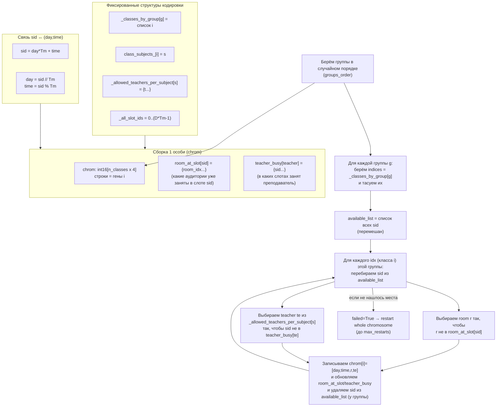
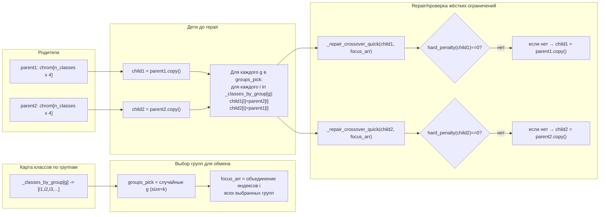
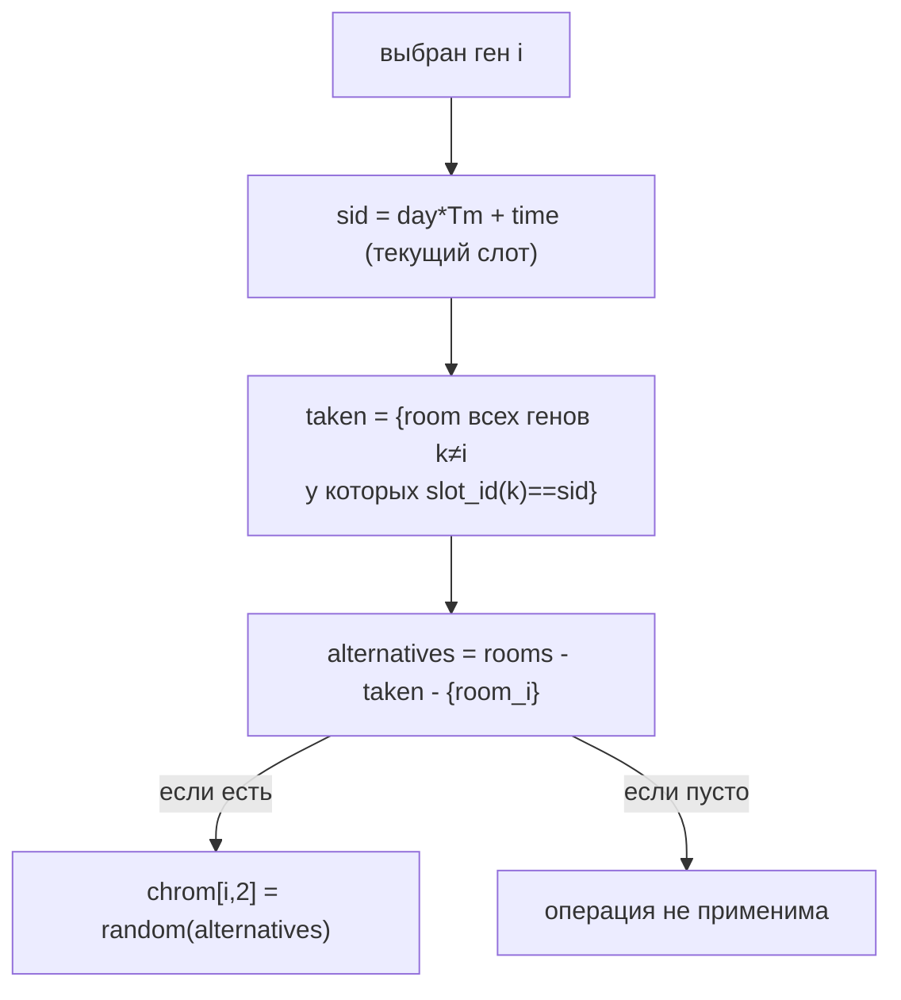
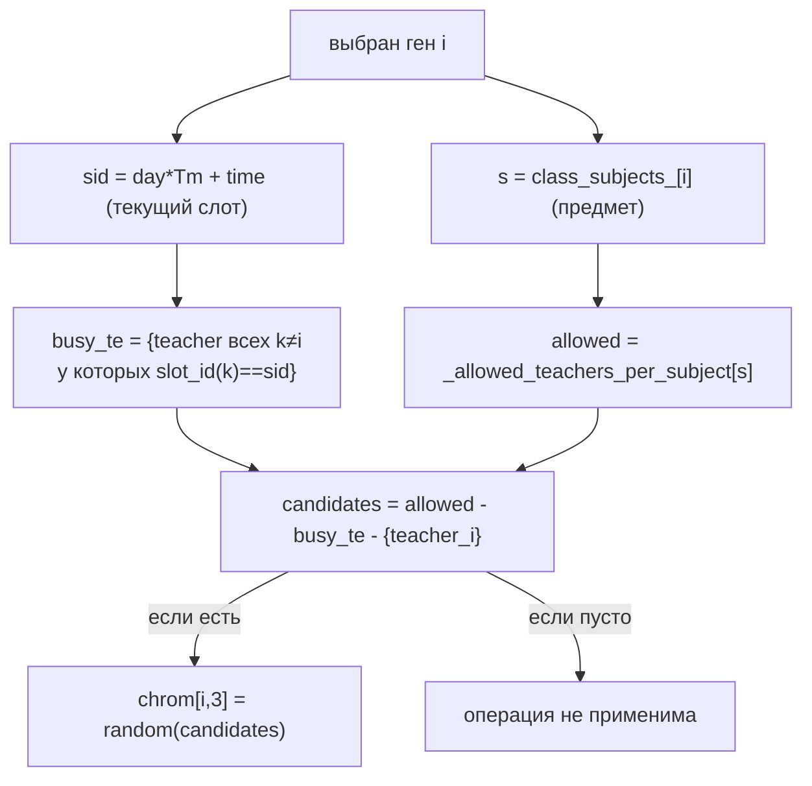
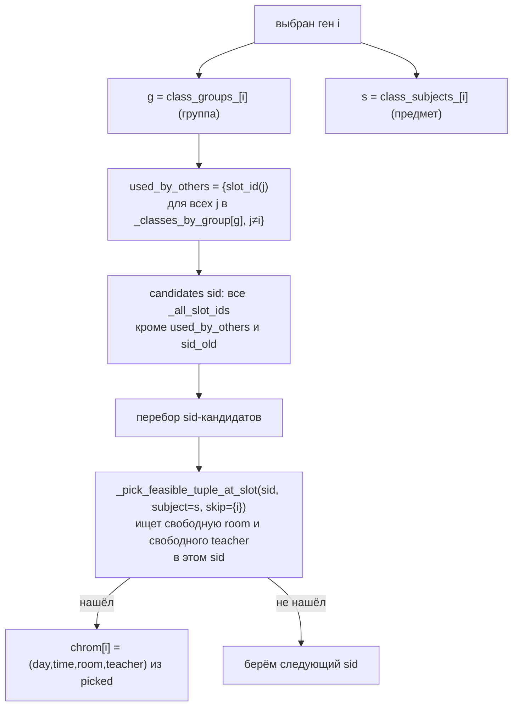
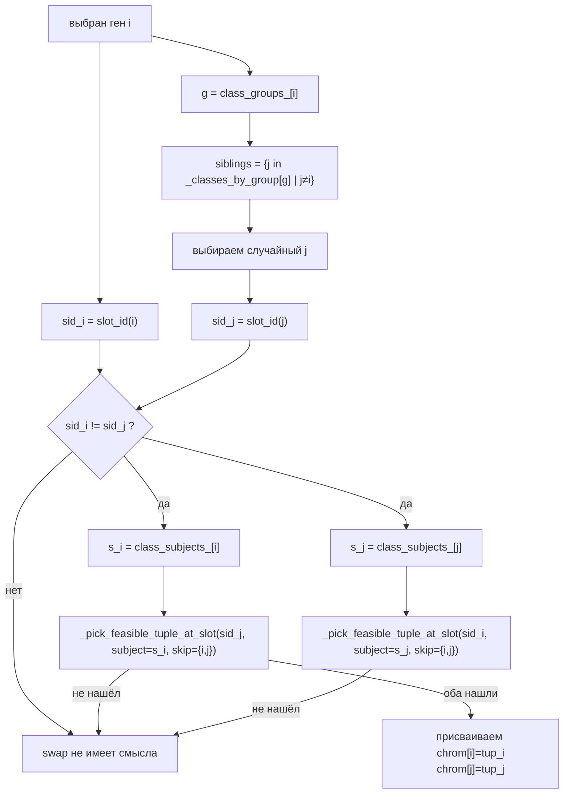

## Кодировка (как данные превращаются в "гены")

## Создание начальной популяции

## Объяснение кроссовера (обмен целыми группами + восстановление)

## Визуальное объяснение каждой мутации (4 типа)

### Мутация room (смена аудитории в том же слоте)

### Мутации teacher (смена преподавателя в том же слоте)

### Мутация reslot (перенос в другой слот + подбор room/teacher)

### Мутация swap (обмен слотами с товарищем по группе + пересбор room/teacher)

